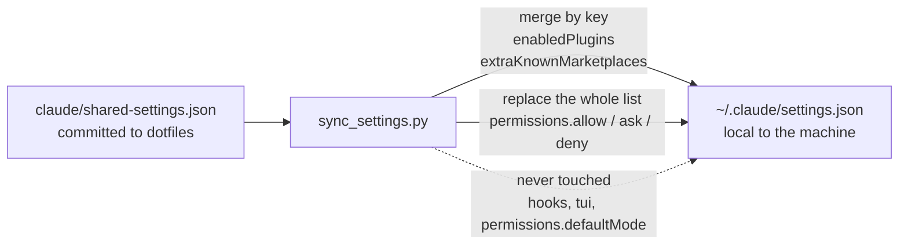

# Claude User Settings Synchronization Design

Status: Approved

Date: 2026-07-29

Issue: #101

## Context

The Claude user settings file is currently symlinked from this repository. That
prevents Claude and local tools from persisting machine-specific settings
without modifying the repository-owned source file.

Claude Code reserves managed settings for organization-enforced policy. This
personal dotfiles workflow needs portable defaults without preventing local
configuration.

## Goals

- Keep portable plugin and marketplace choices in dotfiles.
- Keep the permission rules that are safe in every repository in dotfiles, so
  routine git and GitHub CLI work does not prompt on any machine.
- Preserve hooks, UI preferences, and other machine-specific user settings.
- Migrate the expected legacy symlink without modifying its source.
- Make the migration idempotent and safe for unrelated symlinks.

## Non-goals

- Manage agent-status-bar hooks from this repository.
- Apply organization-level Claude managed settings.
- Remove the legacy settings source during the initial migration.

## Decision

`claude/shared-settings.json` owns `enabledPlugins`, `extraKnownMarketplaces`,
and `permissions`. `claude/sync_settings.py` merges the first two keyed objects
into the regular local `~/.claude/settings.json` file and preserves all other
keys.

`permissions` merges differently. `sync_settings.py` replaces the `allow`,
`ask`, and `deny` lists wholesale rather than taking their union, because a
union cannot revoke: a rule removed from dotfiles would stay granted forever on
every machine that had already synced it. Sibling keys under `permissions` that
the shared fragment does not name, such as `defaultMode`, stay local. The
shared fragment must define all three lists, so a revision that forgets one
fails validation instead of silently clearing it.

The shared lists carry only rules that are safe in *any* repository. `allow`
covers routine git work and the GitHub CLI subcommands used by the issue and
pull-request workflow, plus `gh api` restricted to read-shaped endpoint
prefixes. `ask` narrows rules that a broad `allow` would otherwise swallow, such
as force pushes and `gh api` invocations carrying a write-capable flag. `deny`
is reserved for actions that should never run unattended: repository deletion,
printing an auth token into the transcript, and writing a secret through a
command-line argument.

Read-only git commands are exempt from prompting by Claude Code itself, so the
shared `allow` list does not restate them. That exemption, and every prefix rule
here, is forfeited when git is invoked as `git -C <dir>`; `agents/AGENTS.md`
therefore directs agents to run plain git in the working directory.

The installer replaces only the expected legacy symlink to
`claude/settings.json`. It reads that source, writes the merged content
atomically to the local settings path, and leaves the source unchanged. The
legacy source remains temporarily so a checkout update cannot leave an existing
symlink without a readable migration source.

## Alternatives

- Continue symlinking the complete settings file: rejected because local state
  and tool-owned settings cannot persist safely.
- Use Claude managed settings: rejected because that mechanism enforces
  organization policy and cannot be overridden by user settings.
- Share hooks with the plugin configuration: rejected because agent-status-bar
  owns hook registration independently.

## Consequences

- Running `agents/setup.sh` migrates the expected legacy symlink on each
  machine.
- Local settings outside the shared keys remain local.
- Machine-local permission rules must live in a project's `.claude/settings.json`
  or `.claude/settings.local.json`, because a rule added directly to
  `~/.claude/settings.json` is discarded on the next sync.
- Prefix rules constrain the start of a command, so the `ask` entries are a
  speed bump rather than a boundary. A flag spelling they do not enumerate, such
  as `--method=POST` written with an equals sign in a form not listed, can still
  reach an allowed endpoint. Enforcement, where it is actually required, belongs
  to a `PreToolUse` hook or to GitHub branch protection.
- A follow-up cleanup may remove `claude/settings.json` and the legacy-symlink
  path after all intended machines have migrated.

## Deferred Work

- Verify the migration on each intended machine before removing the legacy
  source.

## References

- Claude Code settings documentation: https://code.claude.com/docs/en/settings
- Claude Code permissions documentation: https://code.claude.com/docs/en/permissions

## Decision log

- 2026-07-29: Replaced the full-file symlink with a merge of `enabledPlugins`
  and `extraKnownMarketplaces` into local user settings, so machine-specific
  settings can persist. (#101)
- 2026-09-12: Added `permissions` as a shared key, with replace-not-union
  semantics for its `allow`, `ask`, and `deny` lists, and seeded it with the git
  and GitHub CLI rules that are safe in every repository. Motivated by repeated
  approval prompts for routine git work; `agents/AGENTS.md` was corrected in the
  same change to stop recommending `git -C`, which defeats prefix matching.
